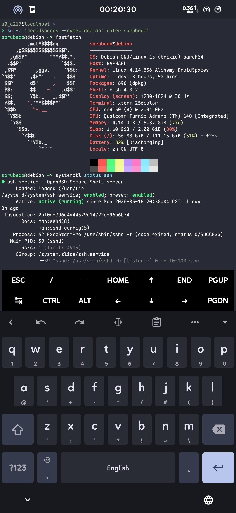

## 🤯 手机里跑个完整的 Linux 发行版？认真的？

认真的。

先把话说清楚：这跟 Termux 那种"在 Android 上用 proot 假装有个 Linux" 完全不是一回事。

[Droidspaces](https://github.com/ravindu644/Droidspaces-OSS) 是一个基于 Linux 内核 namespace 的轻量容器运行时。单个静态二进制，不到 300KB，zero dependency。它直接在 Android 上创建真正的容器 —— 有独立的 PID 树、独立的挂载表、独立的 cgroup 层级，systemd 作为 PID 1 完整启动。

> [!note] 和 Termux/proot 的区别
> proot 只是 ptrace hack，改个路径假装 rootfs。Droidspaces 用的是内核级的 namespace 隔离，跑的是**真 systemd**、**真 Docker**、**真容器**。你可以 `systemctl start nginx`，也可以在容器里再跑嵌套容器。

而我，现在就在手机的 Debian 容器里跑着 [Claude Code](https://docs.anthropic.com/en/docs/claude-code) + `cc-connect`，挂载了手机存储，用聊天软件发指令写文档，[Obsidian](https://obsidian.md/) 实时刷新预览 —— 一条龙。

---

## 🧱 第一步：内核编译 —— 坑比我想象的多十倍

Android 内核编译，听起来就是 `make` 一下的事。实际做起来：

### 你以为的流程
1. 拉源码
2. `make`
3. 刷进去
4. 完事

### 实际流程
1. 拉源码 —— 哪个分支？GKI 还是非 GKI？你的设备用哪个？
2. 找工具链 —— CLANG 版本不对？GCC 链接炸了？
3. 配 defconfig —— 少了一个 `CONFIG_XXX`，容器起不来
4. 编译 20 分钟 → **报错**
5. 修 → 编译 20 分钟 → **又报错**
6. 循环 N 次
7. 终于编出来了，刷进去 → **bootloop**
8. 重来

我之前跟 Gemini 一起捣鼓，来回折腾好几次，内核就是编不过。不是缺依赖就是工具链版本不对，最离谱的是编出来了但刷进去卡在第一屏。那种"明明就差一点但就是不行"的感觉，懂得都懂。

> [!warning] 避坑警告
> Android 内核编译最大的坑不是技术难度，而是**信息碎片化**。XDA 上的教程过时三年，GitHub 上的脚本缺依赖不报错，Telegram 群里的答案永远是"read the docs"（然后 docs 不存在）。

### 转折点：Android Kernel Tutorials

最后是 Droidspaces 项目推荐的这篇教程救了我：

**[👉 github.com/ravindu644/Android-Kernel-Tutorials](https://github.com/ravindu644/Android-Kernel-Tutorials)**

这大概是我见过对新手最友好的 Android 内核编译指南。从内核源码结构、工具链选择、defconfig 定制、补丁应用，到最终打包签名 boot image，每一步都写清楚了。甚至提供了 Docker 容器化的编译环境，不用自己折腾工具链版本。

我照着一步步来，**一次就编过，一次就启动**。虽然只是按图索骥，没有任何原创性可言，但那种"它真的开机了"的成就感，比写完一千行代码还爽。

---

## 🐳 Droidspaces：让手机变成容器母鸡

内核编好、刷入、开机。接下来就是主角了。

[Droidspaces](https://github.com/ravindu644/Droidspaces-OSS) 的使用体验出奇地好：

### 安装就是下载一个 APK

[GitHub Releases](https://github.com/ravindu644/Droidspaces-OSS/releases/latest) 直接下，装上就能用。Android 端有完整的 GUI，容器创建、配置、启动、进终端，全部点几下就行。

### 真正的 FHS Linux 发行版

我拉了个 Debian rootfs（[预构建模板](https://github.com/ravindu644/Droidspaces-rootfs-builder/releases/latest)直接用），启动后：

```bash
systemctl status   # 它真的在跑
apt install nginx  # 真的能装
ip a               # 独立网络栈
```

没有阉割，没有 hack，就是一个完整的、符合 FHS 标准的 Linux 系统。在手机上。



### 挂载手机存储

Droidspaces 支持把 `/storage/emulated/0` bind-mount 进容器。这意味着：

- 容器里的 [Claude Code](https://docs.anthropic.com/en/docs/claude-code) 可以直接读写手机上的文件
- 用 [Obsidian](https://obsidian.md/) 打开同一个目录，实时预览和编辑
- 写博客、改代码、跑脚本 —— 全部在手机上闭环

> 我在外面的时候，掏手机 → 开 Droidspaces → 进容器 → `claude` 一句指令，文档就写好了。回来打开电脑，Obsidian 已经同步完了。

---

## 🎯 我的实际部署

说下我在手机 Debian 容器里跑了什么：

| 服务              | 用途                         |
| :-------------- | :------------------------- |
| **Claude Code** | 写文档、改代码、折腾配置               |
| **cc-connect**  | 让 Claude Code 接入聊天软件，随时发指令 |
| **Obsidian**    | 通过挂载存储访问同一份文件，实时编辑预览       |

工作流大概是：

1. 聊天软件里发一句「帮我写篇关于 xxx 的文章」
2. cc-connect 把消息转发给容器里的 Claude Code
3. Claude Code 写好 md 文件，直接写进挂载的手机存储
4. Obsidian 自动检测文件变动，实时显示
5. 我切到 Obsidian 看一眼，不满意就继续改

> 这一切，都跑在一台手机上。一台装了自定义内核、跑了 LXC 容器的 Android 手机。

---

## 🦗 当然也不是没毛病

- **吃电**：跑容器的时候电量掉得比平时快，毕竟 systemd 在后台管着一堆服务
- **发热**：跑编译的时候手机可以当暖手宝
- **内核兼容**：不是所有设备的 kernel 都支持容器所需的 namespace 特性，需要自己编译开启
- **SELinux**：有些 ROM 的 SELinux policy 会阻止容器操作，需要调成 permissive 或者补 policy

但这些问题，[Droidspaces 的文档](https://github.com/ravindu644/Droidspaces-OSS/tree/main/Documentation) 基本都覆盖了。它的 built-in requirements checker 能直接告诉你缺什么内核特性，不用自己对着 dmesg 猜。

---

## ✨ 总结

如果你符合以下条件中的任意一条：

- 想手机上跑个真正的 Linux 环境，不是 proot 那种假货
- 有 Root 权限，愿意折腾内核
- 想把手机当成便携服务器
- 单纯觉得「在手机上跑 Docker」这件事很酷

那 Droidspaces 值得一试。

**[👉 github.com/ravindu644/Droidspaces-OSS](https://github.com/ravindu644/Droidspaces-OSS)**

如果内核编不过，先去把这篇教程读一遍：

**[👉 github.com/ravindu644/Android-Kernel-Tutorials](https://github.com/ravindu644/Android-Kernel-Tutorials)**

---

> [!quote] 最后
> 别人的手机：微信、抖音、原神。
> 我的手机：systemd、nginx、容器集群。
> 没什么用，但真的超爽 🫡
